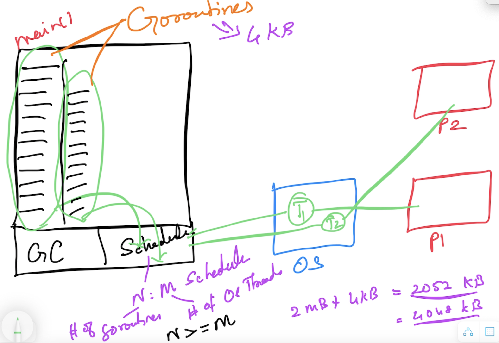
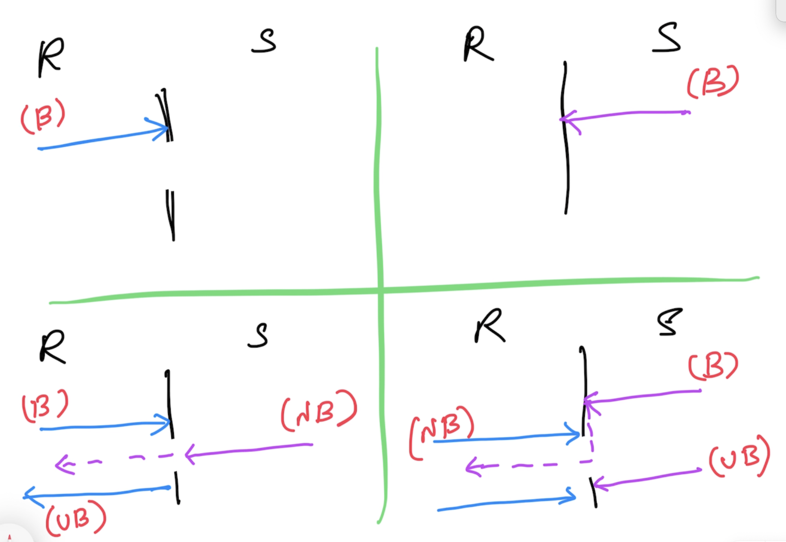

# Go Advanced

## Magesh Kuppan

## Schedule
- Commence      : 9:00 AM
- Tea Break     : 10:30 AM (20 mins)
- Lunch Break   : 12:30 PM (1 hour)
- Tea Break     : 3:00 PM (20 mins)
- Wind up       : 5:00 PM

## Methodology
- No powerpoint
- Discussion & Code

## Repository
- https://github.com/tkmagesh/cisco-advgo-jan-2024

## Basics
- Data Types, Language Constructs
- Functions, Higher Order Functions
- Collections (Arrays, Slices, Maps)
- Pointer
- Error Handling, Panic & Recovery
- Type Assertion, Interfaces
- Structs, Methods
- Modules & Packages

## Recap
- Interfaces

## Managed Concurrency
- Concurrency
    - Ability to have more than one execution path
    - Concurrency is NOT parallelism
- Builtin scheduler
- Concurrent operations are represented as goroutines (cheap = 2KB)
- Language support for concurrency
    - go keyword
    - channel data type
    - channel operator ( <- )
    - range, select-case constructs

### Concurrent Safe State Management
- To detect data race run/build with race detector
    - > go run -race [program.go]
    - > go build -race [program.go]
    - Note: DO NOT create a production build with race detector
### Communication (channel)
- Declaration
    - > var ch chan int
- Initialization
    - > ch = make(chan int)
- Declaration & Initialization (type inference)
    - > ch := make(chan int)
- Operation (using channel operator ( <- ))
    - Send Operation
        - > ch <- [data]
    - Receive Operation
        - > data := <- ch
- Behavior
    - A RECIEVE operation is ALWAYS a blocking operation (blocked until the data is sent through the channel)
    - A SEND operation is blocked until a RECIEVE operation is initiated

## Context
- cancel propagation
- context.Background() is the base of the context chain
- context.WithCancel() 
- context.WithTimeout() (timeout in relative time)
- context.WithDeadline() (timeout in absolute time)
- context.WithValue()

## GRPC
- Alternative to HTTP based restful services
- Optimal for micro-services communication
- Communication Patterns
    - Request & Response
    - Server Streaming (one request & stream of responses)
    - Client Streaming (stream of requests & one response)
    - Bidirectional Streaming (stream of requests & stream of responses)
- HTTP2
- Uses Protocol Buffers for serializing payloads
    - Share the schema among the consumers and producers in advance
- Multi-language supports
    - Go
    - Java
    - .NET
    - Node.js
    - Python
### Steps: 
    - Create service / operations / data contracts using protocol buffers
    - Share the contract between the client & server
    - Generate proxy & stub using the contracts
    - Server
        - implement the service (with the business logic) based on the contract
        - host the service
    - Client
        - Use the proxy to communicate to the service

### Tools Installation 
    1. Protocol Buffers Compiler (protoc tool)
        Windows:
            Download the file, extract and keep in a folder (PATH) accessble through the command line
            https://github.com/protocolbuffers/protobuf/releases/download/v24.4/protoc-24.4-win64.zip
        Mac:
            brew install protobuf

        Verification:
            protoc --version

    2. Go plugins (installed in the GOPATH/bin folder)
        go install google.golang.org/protobuf/cmd/protoc-gen-go@v1.28
        go install google.golang.org/grpc/cmd/protoc-gen-go-grpc@v1.2

## Database
- Standard Library
- Code generation tools
    - Using sqlc (https://docs.sqlc.dev/en/latest/overview/install.html)
- 3rd party libraries that are wrappers over the standard library apis
    - Using sqlx (https://github.com/jmoiron/sqlx)
- ORM

## Code Generation
> go generate ./...